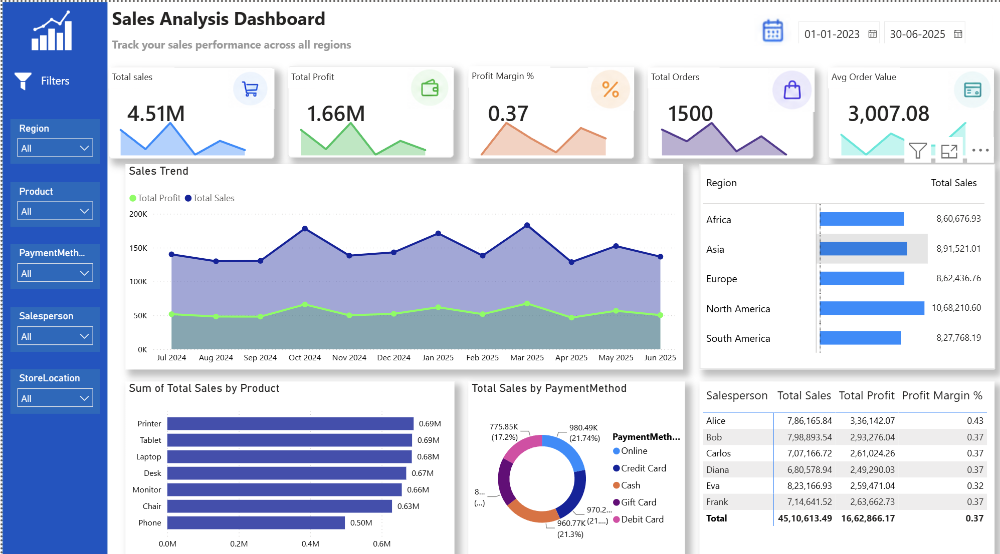

# Sales-Insights-PowerBI

## Project Overview

Sales Insights Power BI is an interactive dashboard designed to analyze sales performance and profitability. It provides a clear view of key business metrics and helps identify trends across regions, products, payment methods, and salespersons.

## Objectives

- Analyze overall sales and profit performance.
- Track important sales KPIs.
- Identify monthly sales and profit trends.
- Compare sales across regions and products.
- Analyze payment methods and salesperson performance.
- Support data-driven business decisions.

## Dataset

The dataset contains 1,500 sales records with 19 attributes covering product details, sales, customers, regions, payment methods, promotions, returns, shipping, and order/delivery information.

The data was imported into Power BI and prepared for analysis before creating the dashboard.

## Tools & Technologies

- Power BI
- Power Query
- DAX
- Data Visualization

## Dashboard Features

- Total Sales
- Total Profit
- Profit Margin
- Total Orders
- Average Order Value
- Monthly Sales & Profit Trends
- Region-wise Sales Analysis
- Product-wise Sales Analysis
- Payment Method Analysis
- Salesperson Performance Analysis
- Interactive filters for Region, Product, Payment Method, Salesperson, and Store Location

## Key Insights

- North America has the highest sales among the displayed regions.
- Product sales vary across different categories.
- Sales and profit show different trends across months.
- Payment methods contribute differently to overall sales.
- Salespersons can be compared based on sales, profit, and profit margin.

## Dashboard Preview

## Conclusion

This project demonstrates the use of Power BI to transform sales data into an interactive business dashboard. It combines data preparation, DAX calculations, KPIs, and visualizations to analyze sales performance and support data-driven decisions.
